# Comprensión de los datos - Obtención de los datos

## Web Scraping

El web scraping es una técnica utilizada para extraer datos de sitios web de forma automatizada. A través de programas o scripts, se accede al contenido de una página web, se analiza su estructura HTML y se extrae información específica, como texto, imágenes, precios de productos, titulares de noticias, entre otros.

### HTML

HTML (HyperText Markup Language) es el lenguaje estándar utilizado para estructurar y presentar contenido en la web. Es un lenguaje de marcado que define la estructura básica de las páginas web mediante etiquetas. Estas etiquetas indican al navegador cómo debe interpretar y mostrar el contenido, como texto, imágenes, enlaces, y otros elementos.

Para realizar`*scraping* en un sitio web necesutaremos navegar en el código HTML para encontrar lo que nos interesa.

Ejemplo de un código simple de HTML

````html
<html>
	<body>
		<div>
			<p>Hello world!</p>
			<p>Hello world!</p>
		</div>
			<p>Thanks for all!</p>
	</body>
</html>
````

Estructura de un documento HTML:

	1.	<!DOCTYPE html>: Declara el tipo de documento como HTML5.
	2.	<html>: Representa la raíz del documento.
	3.	<head>: Contiene metadatos sobre el documento (como el título y enlaces a hojas de estilo).
	4.	<body>: Incluye todo el contenido visible de la página.

Algunas etiquetas comunes:

1.	Encabezados: `<h1>` a `<h6>` para títulos y subtítulos. Ejemplo: `<h1>Encabezado principal</h1>`.
2.	Párrafos: `<p>` para texto de párrafo. Ejemplo:`<p>Este es un texto.</p>`.
3.	Enlaces: `<a href="URL">Texto del enlace</a>`.
4.	Imágenes: ``.
5.	Listas:
    - No ordenadas: `<ul>` con `<li>`.
    - Ordenadas: `<ol>` con `<li>`.

#### Árbol HTML

Las etiquetas están anidadas unas dentro de otras, como las etiquetas `body`dentro de `html`. Esto da lugar a la jerarquía, que se representa como un árbol. 

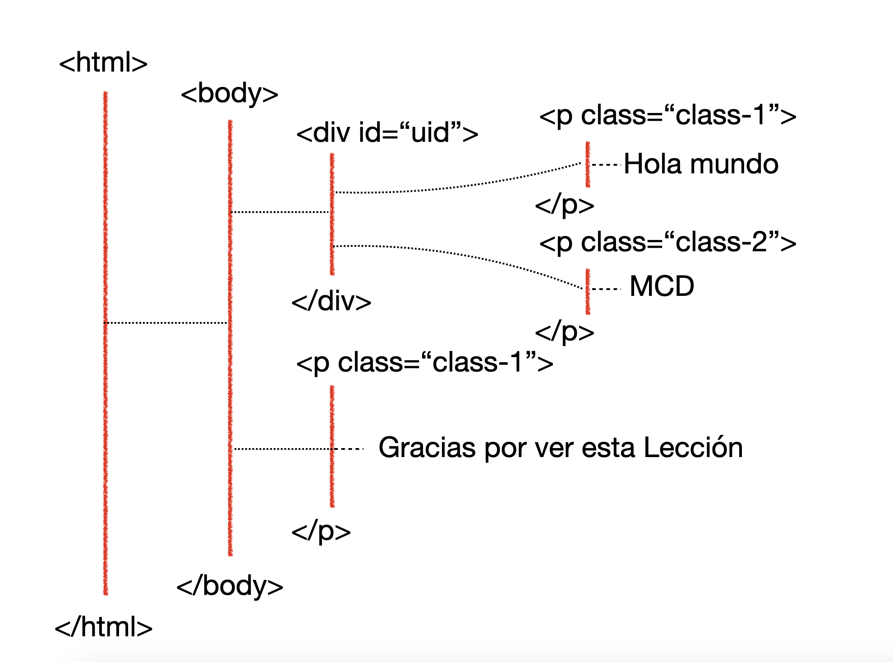

#### Atributos 

Ejemplo de un formato de los atributos de una etiqueta abstracto
```html
<tag-name attrib-name="attrib info">
	..element contents
</tag-name>
````
Las etiquetas __html__, __div__, y __p__ pueden contener atributos que proporcionan instrucciones especiales para el contenido incluido. 
Los atributos están seguidos por un signo igual, seguido de información que es valor del atributo.

Ejemplo específico de un __div__:
````html
<div id="unique-id" class="some class">
	..div elemen contents
</div>
````

El atributo `id` se utiliza como identificador único para el elemento de etiqueta.
El atributo `class` también nos ayuda a identificar este `div` pero no es único. 
No todas las etiquetas tienen un `id` o `class` pero a todas las etiquetas se les puede asignar ambos. 
- Una etiqueta puede pertenecer a múltiples clases, cuando el atributo de clase tiene múltiples nombres de clases separados por espacios, en el ejemplo anterior la etiqueta `div` pertenece a las clases: `some` y `class`.
Otro ejemplo:
````html
<a href="https://www.utm.mx">
	Este es el link a la página de la universidad
</a>
````
- La etiqueta `a` es un hipervínculo, y tiene el atributo `href` que indica la página a la que se dirige la liga.
- Existen muchos tipos de etiquetas permitidos 
- Y muchos atributos que dependen del tipo de etiqueta.
  
### XPath

XPath (XML Path Language) es un lenguaje utilizado para navegar y seleccionar nodos en un documento XML. Permite localizar elementos, atributos, o texto dentro de un documento XML de manera eficiente, utilizando rutas y patrones específicos.

Nosotros utilizaremos XPath para convertir la navegación verbal de una estructura HTML en una variable para que la computadora la pueda procesar.

#### Notación de XPath

- La barra diagonal `/` se utiliza para avanzar una generación adelante del nodo actual, como si se navegara en directorios o escribiendo una url en el navegador.
- Los nombres de etiquetas entre las diagonales, indican la dirección de los elementos o nodos.
- Los `[]` delante un nombre de etiqueta indica cual de los hermanos elegir. Por ejemplo, puede haber varios elementos `div`que sean hijos de un elemento `body`.


````python
xpath = '/html/body/div[2]'
````
En el ejemplo anterior represena la ruta para llegar el tercer `div` descendiente de `body`, como se muestra en la siguiente figura.

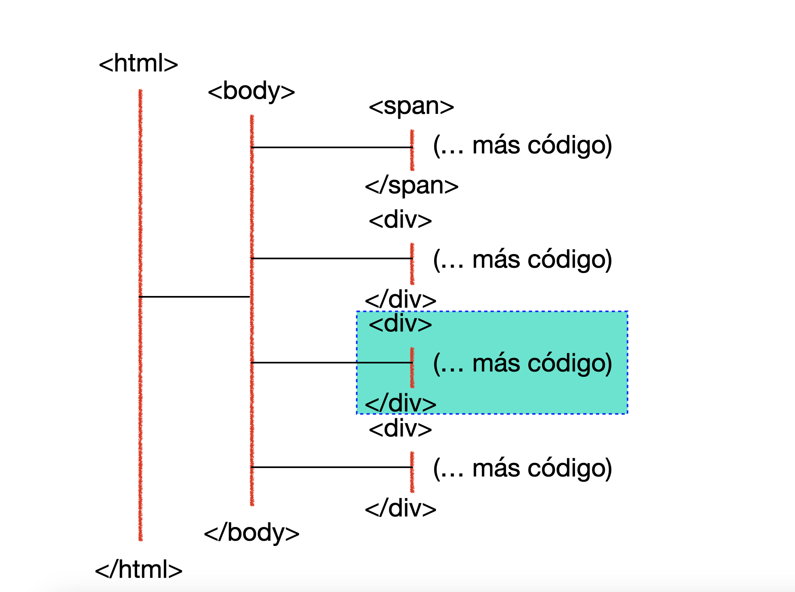

- La barra diagonal doble `//` se utiliza para avanzar en todos los descendientes del nodo actual, es decir. todas sus generaciones siguientes. 

Por ejemplo, navegar a todos los elementos de tipo `table` dentro del código HTML.

````python
xpath = '//table'
````
[`Ejercicio 1`](./exercise/exercise-1-where.ipynb)

#### Atributos en XPath

El uso del símbolo `@` en la notación XPath representa un atributo, por ejemplo: `@class`, `@id`, `@href`. 

Si consideramos la extructura del siguiente código HTML:


La forma de indicar un atributo es mendiante corchetes `[]`, por ejemplo, el siguente `xpath` se dirige a todos los elementos `p` y luego reduce a aquellos cuyo atributo sea igual a `class-1`:

```python
xpath = '//p[@class="class-1"]'
```

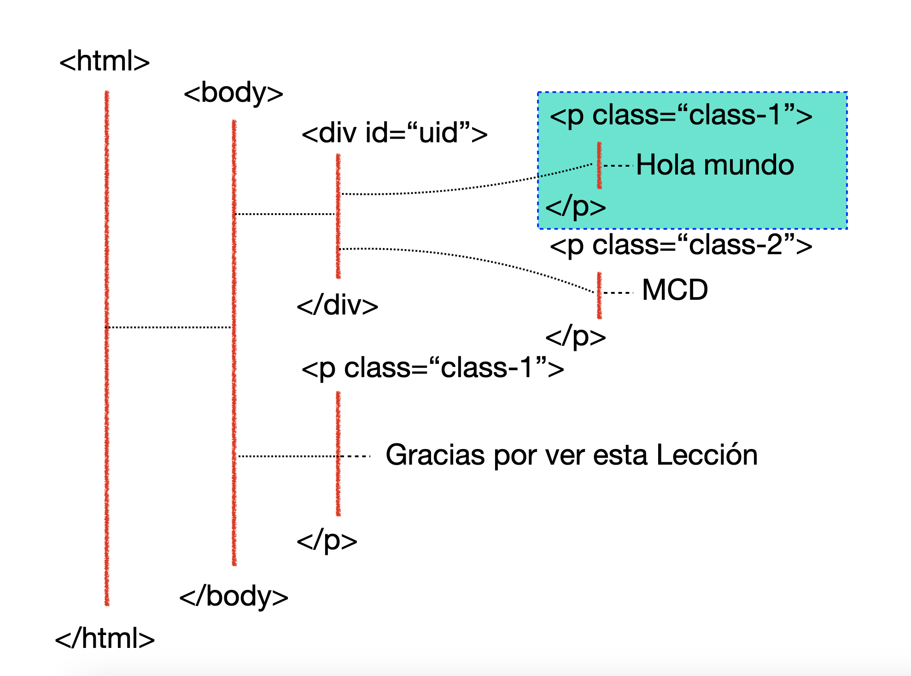

En otro ejemplo:

```python
xpath = '//*[@id="uid"]'
```

El XPath se dirige a todos los elementos y se reduce a cualquier elemento que tenta `uid` como atributo `id`.  Por lo que podemos considerar que `*` es el comodín para represenar cualquier tipo de etiqueta.

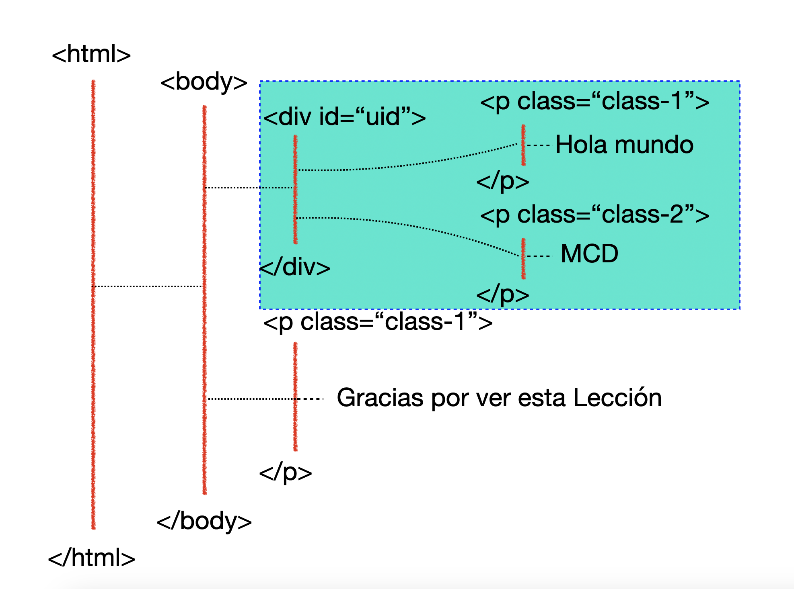

Si consideramos el siguente ejemplo:

```python
xpath = '//div[@id="uid"]/p[2]'
```
El XPath anterior se dirige a todos los elementos `div` reduce a aquellos que tengan `uid` como atributo `id` y por último, reduce al segundo párrafo `p` hijo.

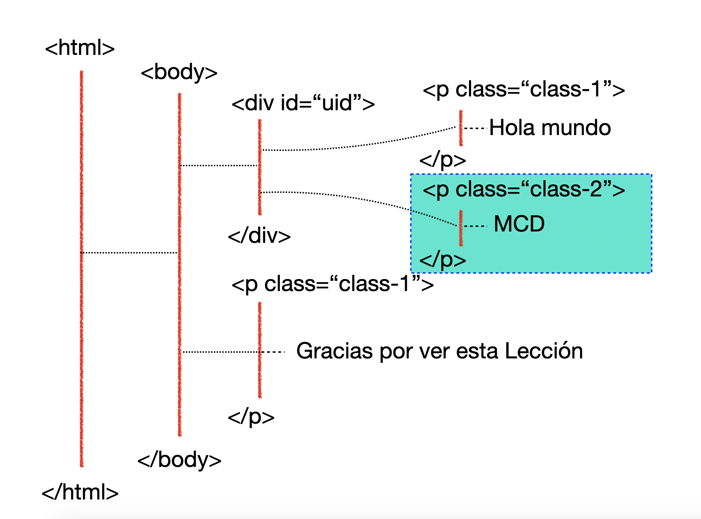

#### Uso de `contains`

La función `contains` se puede utilizar dentro de la notación XPath con la finalidad de encontrar subcadenas en el atributos específicado.

Forma general de `contains`:

```python
contains(@attri-name, "string-expr")
```

El formato de `contains` incluye como primer parámetro el nombre del atributo, el parámetro derecho indica la subcadena que queremos buscar dentro del atributo.
 
Por ejemplo:

```python
xpath = '//*[contains(@class, "class-1")]'
```

En la expresión anterior se eligen a todos los elementos donde en el valor del atributo `class` se encuentra contenida la cadena `class-1` como subcadena. Por lo tanto, en la siguiente figura se muestra tres casos de etiquetas que cumplen con tales condiciones. Nótese como en el caso de `"class-12"` se encuentra contenida la subcadena `"class-1".` 

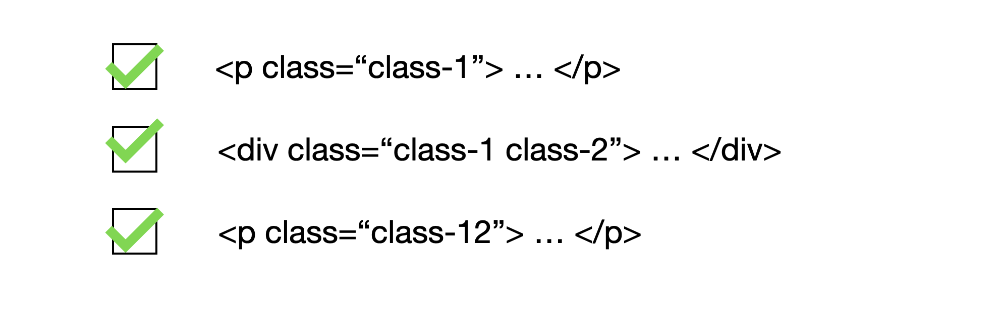


En contraste con el uso de `@`, si comparamos los resultados del siguiente ejemplo:

```python
xpath = '//*[class="class-1"]'
```

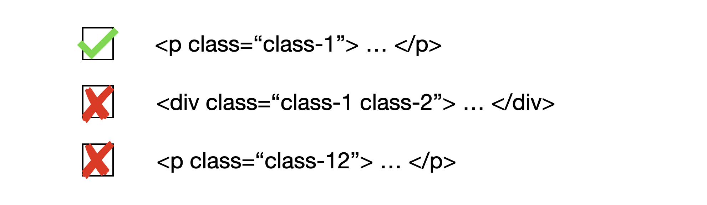

A diferencia de `contains` solo se seleccionan aquellas etiquetas donde el atributo `@class` coincide exactamente con el valor `"class-1"`.

#### Obtención del valor del atributo

En algunas cirunstancias el uso de los atributos no solo guirán la extracción de la información, si no que, necesitaremos obtener el valor contenido en algún atributo. En el siguiente ejemplo, se muestra la diferencia entre obtener la información contendia entre las etiquetas en contraste con obtener el valor contenido en el atributo.

```python
xpath = '/html/body/div/p[2]'
```

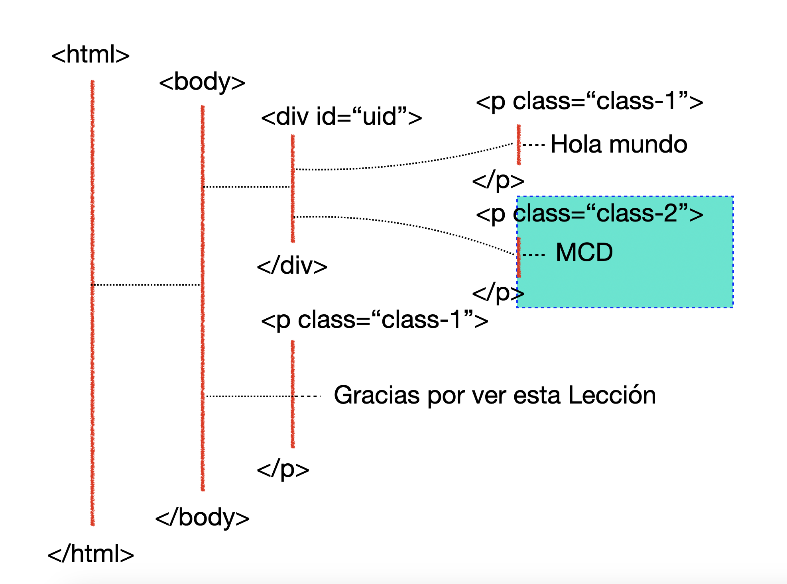

En el ejempo anteior, el resultado es `"MCD"`. Mientras que en el siguiente ejemplo, se obtiene el contenido del atributo `@class`, es decir, `"class-2"`.

```python
xpath = '/html/body/div/p[2]/@class'
```


#### Encadenamiento de XPath

Los objetos `Selector`y `SelectorList` permiten el encadenamiento al utilizar el método `xpath`. Lo que significa que se puede aplicar la notación `xpath` una vez más, que ya se ha aplicado una primera vez. Por ejemplo:

```python
sel.xpath('/html/body/div[2]')
```

Es igual a:
```python
sel.xpath('/html').xpath('./body/div[2]')
```

ó a:

```python
sel.xpath('/html').xpath('./body').xpath('./div[2]')
```

La única diferencia es, que se tienen que pegar las piezas de XPath al utilizar el punto `.` al principio de cada subcadena de XPath.


[Ejercicio 2.](./exercise/exercise-2-xpath.ipynb)

#### La fuente de la fuente: de donde vienen los documentos HTML

Es necesario considerar dos herremientas que serán de utilidad cuando realices *scraping* a un sitio web. 

- visualizar el código fuente en tu navegador
- El inspector de código HTML

Ambas herremientas están disponibles en tu navegador, sin importar cual utilices. Solo es cuestión de que identifiques en que sección puedes disponer de ellos.

Por ejemplo, la opción **"ver código"** en Chrome se puede acceder al realizar clic derecho sobre la página en cuestión.

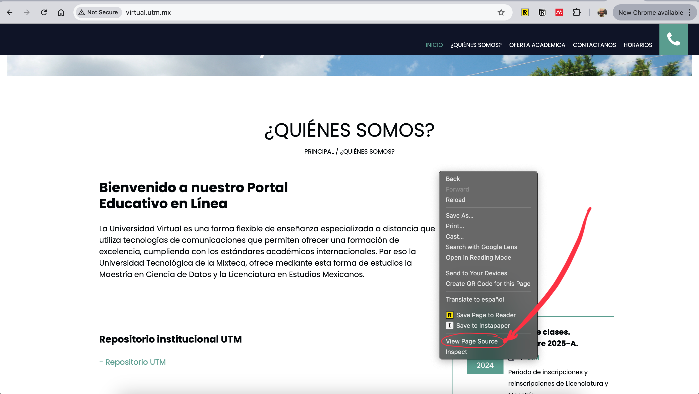

La opción **inspect** o **inspeccionar** te mostrará una sección con la posibilidad de acceder a las herramientas para desarrolladores. Son útiles para probar el diseño de las páginas web, depurar, omitir información sensible de las capturas de pantalla, investigar palabras clave ocultas y mucho más.

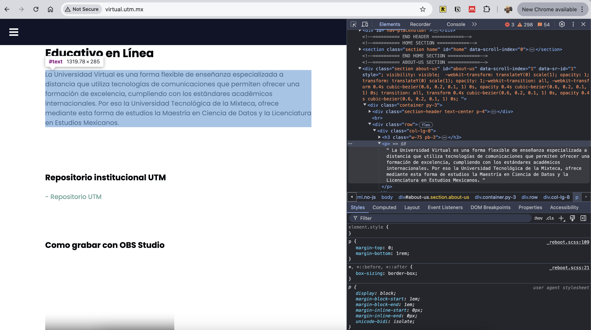

Te invito a investigar más acerca de estas dos herramientas, ya que te serán muy utiles en tus proyectos de extracción de datos mediante `scraping`.

### CSS Locators

Los CSS Locator son una forma alternativa a los XPath.

CSS Locators son selectores utilizados en CSS para identificar y aplicar estilos a elementos específicos en una página web. También son ampliamente utilizados en pruebas automatizadas (como en Selenium) para interactuar con elementos del DOM.

#### Notación CSS Locator

Una vez que hemos aprendido la notación de XPath nos resultará muy fácil comprender la notación de CSS Locators.

Vamor a reemplazar `/`  por `>`(excepto el primer carácter `/` es ignorado)
- XPath: `/html/body/div`
- CSS Locator: `html>body>div`
  
Vamos a reemplazar `//` por un espacio en blanco (excepto si es el primer carácter, es ignorado)
- XPath: `//div/span//p`
- CSS Locator: `div > span p`

Por último, vamor a reemplazar `[N]` por `:nth-of-type(N)`
- XPath: `//div/p[2]`
- CSS Locator: `div > p:nth-of-type(2)`

#### Atributos `class` y `id`

La razón principal para aprender CSS Locator como una alternativa a XPath es su notación simple para la identificación de atributos de clases y de identificación.

- Para encontrar elementos por **clase** se utilizar `.`
	- Ejemplo: `p.class-1` selecciona todos los elementos de párrafo pertenecientes a `class-1`.
- Para encontrar un elemento por **id** se utiliza `#`
	- Ejemplo: `div#uid` selecciona los elementos `div`con `id` igual a `uid`.

Para seleccionar los elementos de párrafo con la clase `class1` se utiliza:
````python
css_locator = 'div#uid > p.class1'
````
Para seleccionar todos los elementos los cuales su atributo clase pertenece a `class1`:
````python
css_locator = '.class1'
````

Algunos aspectos a considerar al utilizar CSS Locator como alternativa de XPath, son los siguientes:

```python
css = '.class-1'
```
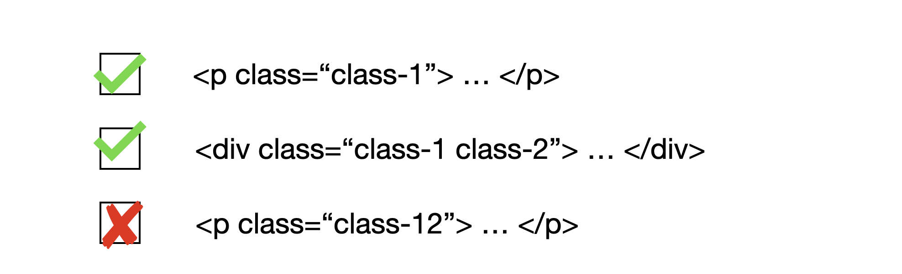


```python
css = '//*[@class="class-1"]'
```
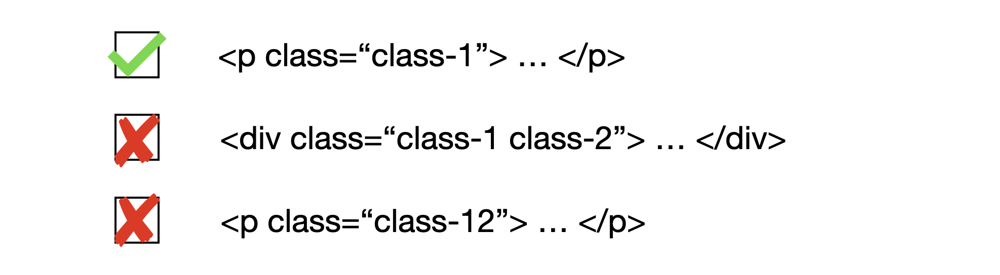

- En el ejemplo del CSS Locator nos dirige a los elememtos que pertenecen a la clase `class-1` incluso si pertenece a otras clases
- En el ejemplo de XPath, la igualdad obliga a una coincidencia exacta del atributo de la clase, por lo que solo, aquellas etiquetas que councidan unicamente con `class-1` son seleccionadas.

Como complemento a esta diferencia, es necesario que consideremos que, si utilizamos `contains` el XPath busca todas las coincidencias con la subcadena.

```python
css = '//*[contains(@class, "class-1")]'
```
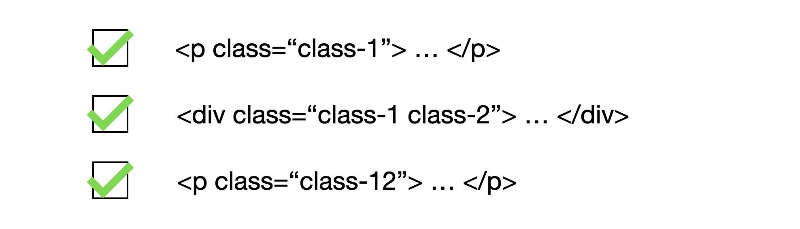

#### Atributos CSS y selección de texto

Al igual que en XPath, podemos acceder a los atributos y al texto.

- En notación XPath: `<xpath-to-element>/@attr-name`
```python
xpath = '//div[@id="uid"]/a/@href'
```
- En CSS Locator: `<css-to-element>::attr(attr-name)`
```python
css_locator = 'div#uid > a::attr(href)'
```
Para realizar la extracción de texto

```html
<p id="p-example">
	Hello world!
	Visit <a href="http://www.utm.mx">UTM</a> today!
</p>
```
- En XPath se utiliza el método `text()`
Si se utiliza diagonal simple, se obtiene el texto de la etiqueta actual
```python
sel.xpath('//p[@id="p-example"]/text()').extract()
# El resultado ['\n Hello world!\n Visit', 'today!\n']
```
Si se utiliza doble diagonal, se obtiene el texto y el texto de los descendientes
```python
sel.xpath('//p[@id="p-example"]//text()').extract()
# El resultado ['\n Hello world!\n Visit', 'UTM', 'today!\n']
```
- Para CSS Locator, se utiliza `::text`
```python
sel.css('p#p-example::text').extract()
# El resultado ['\n Hello world!\n Visit', 'today!\n']

sel.css('p#p-example ::text').extract()
# El resultado ['\n Hello world!\n Visit', 'UTM', 'today!\n']
```

[Ejercicio 3](./exercise/exercise-3-css-locator.ipynb)

### Spiders

Un spider en el framework Scrapy es una clase que define cómo un bot (crawler) que debe navegar y extraer información de uno o más sitios web. Los spiders son el núcleo del proceso de web scraping en Scrapy, ya que contienen las reglas y la lógica para obtener los datos deseados.

**¿Qué hace un spider?**
1. **Define las URLs objetivo:** Indica de dónde debe comenzar el scraping.
2. **Controla la navegación:** Decide cómo moverse entre enlaces dentro del sitio web.
3. **Extrae datos:** Selecciona y procesa la información deseada utilizando selectores XPath o CSS.
4. **Guarda los datos:** Exporta la información recolectada en formatos como JSON, CSV, o bases de datos.

Estructura básica de un spider en Scrapy:

1. Hereda de la clase `scrapy.Spider`.
2. Define atributos clave:
   - `name`: El nombre único del spider.
   - `start_request`: retorna un con el Request a rastrear.
3. Implementa el método `parse()`:
   - Recibe las respuestas HTTP de las páginas visitadas.
   - Contiene la lógica para extraer datos y/o seguir enlaces a otras páginas.

- [ver docuemntación](https://docs.scrapy.org/en/latest/topics/spiders.html)

Ejemplo de la estructura básica de spider en `scrapy`:

```python
class UTMspider(scrapy.Spider):
	name = 'utm_spider'

	def start_requests(self):
		urls = ['https://www.utm.mx/ensenanza.html#oferta']
		for url in urls:
			yield scrapy.Request(url = url, callback = self.parse)

	def parse(self, response):
		# simple example: write out the html
		html_file = 'utm_carrers.html'
		with open(html_file, 'wb') as fout:
			fout.write(response.body)

process = CrawlerProcess()
process.crawl(UTMspider)
process.start()
```

#### Start Request

El método `start_request`  debe ser defino con este nombre específico,

```python
def start_requests(self):
		urls = ['https://www.utm.mx/ensenanza.html#oferta']
		for url in urls:
			yield scrapy.Request(url = url, callback = self.parse)
```
- `scrapy.Request` devolverá una variable Response
- el argumento `url` nos dice que sitio se raspa
- el argumento `callback` indica donde mandar la variable respuesta para su procesamiento.

#### Parse

El nombre del método `parse` no es obligatorio identificarlo con tal nombre, es opcional. 

```python
	def parse(self, response):
		# simple example: write out the html
		html_file = 'utm_carrers.html'
		with open(html_file, 'wb') as fout:
			fout.write(response.body)
```

En el segmento de código anterior, la implementación solo almacena en un archivo llamado `'utm_carrers.html'` el contendio del objeto `response`.

En este método `parse` es donde podemos desarrollar nuestras habilides aprendidas hasta ahora sobre XPath y CSS Locator. Por ejemplo:

```python

	def parse( self, response ):
		links = response.css('div.course-block > a::attr(href)').extract()
		filepath = 'DC_links.csv'
		with open( filepath, 'w') as f:
			fout.write(link + '/n' for link in links)
```

En este segundo ejemplo, el `response` contiene el documento, muy similar a lo que habiamos hecho hasta ahora con `Selector`. Por lo que, con el CSS Locator `div.course-block > a::attr(href)'` se extrae los datos objetivo (en este caso el atributo `href` de una etiqueta `a`). Para despues almacenarlas en una archivo `UTM_links.csv`. 

[Ejercicio 4](./exercise/exercise-4-spider.ipynb)

### Proyecto scraper

En esta sección aprenderás a utilizar **Scrapy** para construir un spider que extraiga información estructurada del sitio web [Books to Scrape](https://books.toscrape.com). Seguiremos una serie de pasos a detalle para configurar el proyecto, inspeccionar elementos del sitio, manejar paginación y optimizar el spider para obtener todos los datos necesarios.

**1. Creación de un Proyecto Scrapy**

Comienza creando un proyecto con la herramienta de línea de comandos de Scrapy. El comando genera una estructura de carpetas que organiza automáticamente los archivos del proyecto:

```termina
scrapy startproject myproject [project_dir]
```
En la forma general, mediante `scrapy startproject`  crearemos un proyecto llamado `myproject` en el directorio `project_dir`. En el caso de no indicar el nombre del directorio, este será nombrado de la misma forma que `myproject`.

Para crear nuestro proyecto llamado `bookscraper` ejecutaremos la siguiente instrucción en la línea de comandos:

```terminal
scrapy startproject booksscraper
```

El resultado de la instrucción anterior generá la estructura base para la construcción de nuestro scraper, en el directorio `bookscraper`.

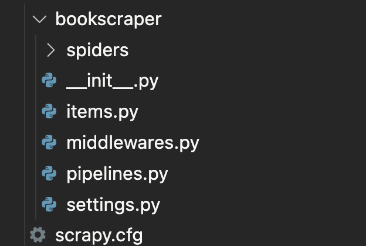

En principio, no analizaremos toda la estructura que es generada para el proyecto. Por el momento, solo nos enfocaremos en el directorio `'spider'`. En este directorio, es donde crearemos nuestra clase principal para el spider. 

Una vez ubicados en el directorio `'spider'` ejecutaremos la siguiente instrucción en la línea de comandos.

La forma general de la instricción para general el nuevo spider es: `scrapy genspider`, seguido del nombre de la clase y la url 
``` terminal
scrapy genspider mydomanin   mydomain.com
```
En este ejemplo crearemos un scraper llamado `bookspider` al sitio web: `books.toscrape.com`:

``` terminal
scrapy genspider bookspider books.toscrape.com
```

Como resultado, se creará el archivo `bookspider.py` dentro de la carpeta `spider`.


 ```python
 import scrapy


class BookspiderSpider(scrapy.Spider):
    name = "bookspider"
    allowed_domains = ["books.toscrape.com"]
    start_urls = ["https://books.toscrape.com"]

    def parse(self, response):
        pass
 ```
La estructura de la clase se muetra a continuación: Este comando crea el archivo bookspider.py, que incluye una plantilla básica para comenzar.

El atributo `allowed_domains` limita el spider a trabajar exclusivamente dentro de los dominios especificados. Esto evita que el scraper realice solicitudes fuera del alcance, como otros subdominios.

El siguiente paso es implementar el método `parse`. Para poner a prueba lo que hemos aprendido de XPath y CSS Locators. Scrapy incluye una consola interactiva muy útil para inspeccionar el sitio y probar selectores. Mejoraremos la experiencia instalando IPython, una herramienta avanzada para trabajar con Python de manera interactiva.

> [IPython](https://ipython.org) es un intérprete interactivo de Python que ofrece una experiencia mejorada para escribir, probar y depurar código. Su diseño es ideal para desarrolladores y científicos de datos que trabajan en entornos interactivos y quieren más funcionalidad que la disponible en el intérprete estándar de Python.

Para instalar IPhyton, ejecutaremos en la linea de comandos la siguiente instrucción.

```
conda install ipython 
```

Adicional, tendremos que configurar IPython como el shell predeterminado para nuestro proyecto. Asi que vamos a agregar a la configuración del archivo `scrapy.cfg` la línea: `shell = ipython`.

```text
[settings]
default = bookscraper.settings
shell = ipython
```

Ahoro podemos ejectura el shell de scrapy en la línea de comandos, mediante la siguiente instrucción:

```terminal
scrapy shell
```

Mediante el comando `fetch` descagamos la URL indicada para comenzar nuestros análisis.

```
fetch ('https://books.toscrape.com/')
```

Ahora probaremos algunos extracciones mediante la inspección del sitio web: [booktoscrape](http://books.toscrape.com) 

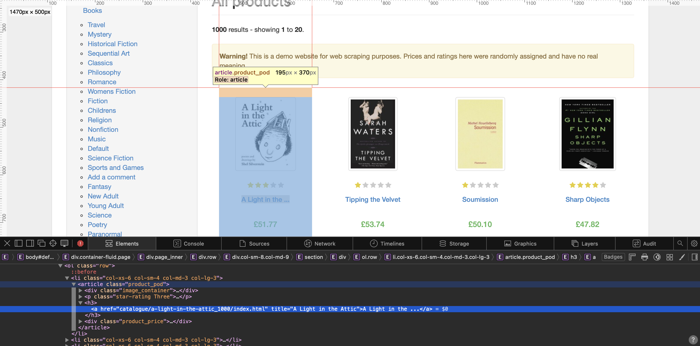

En la terminal ejecutamos 
 ```terminal
response.css('article.product_pod')
response.css('article.product_pod').get()
 ```

Vamos a analizar solo uno de los libros obtenidos:

 ```terminal
books = response.css('article.product_pod')
len(books)
book = books[0]
```
Para obtener el título del libro, el precio y la liga que nos lleva a la página de los detalles del libro:

```terminal
book.css('h3 a::text').get()
book.css('.product_price .price_color::text').get()
book.css('h3 a').attrib['href']
```

**Crear el Método `parse`**

El método `parse` define cómo procesar cada página y extraer los datos necesarios. Implementemos el método para capturar el nombre, precio y enlace de cada libro:

Después de realizar estas pruebas de CSS Loaders,  construyamos nuestro método `parse`.

```python
def parse(self, response):
    books = response.css('response.css("article.product_pod")')
    for book in books:
        yield {
            'name' : book.css('h3 a::text').get(),
            'price' : book.css('.product_price .price_color::text').get(),
            'url' : book.css('book.css("h3 a").attrib["href"]')
        }
```

Ahora, vamoa a ejecutar el spider (recordar salir del shell)nos movemos a la carpeta principal del proyecto y ejecutamos en la línea de comandos. Para ejecutar el spider, regresa a la raíz del proyecto y usa el siguiente comando:

```terminal
scrapy crawl bookspider
```

Es necesario, inspeccionar los resultados para verificar que el `parse` este funcionando de la forma esperada.

**Manejar Paginación**

El sitio tiene múltiples páginas, por lo que necesitamos implementar paginación para capturar todos los libros. Modifiquemos el método parse para incluir navegación a la siguiente página:

Nuevamente abrimos iphyton y realizamos fetch('https://books.toscrape.com') e inspeccionamos alguna de las páginas para conocer la estructura del HTML.

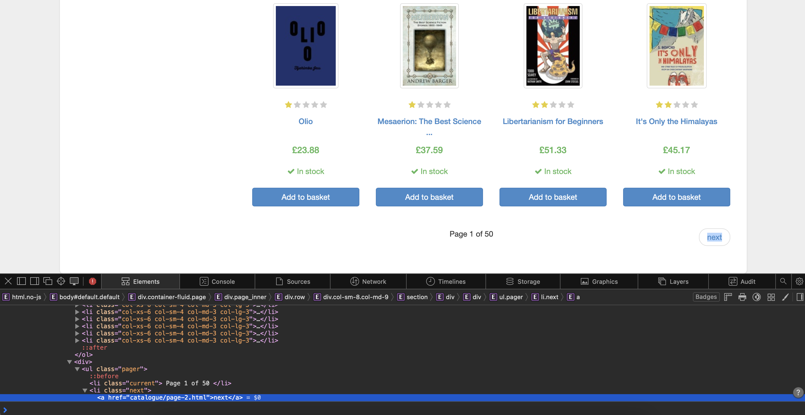

Probamos el CSS Loader en la línea de comandos:

```terminal
response.css('li.next a ::attr(href)').get()
```

Modificamos el método `parse`:

```python
    def parse(self, response):
        books = response.css('article.product_pod')
        
        for book in books:
            yield {
                'name' : book.css('h3 a::text').get(),
                'price' : book.css('.product_price .price_color::text').get(),
                'url' : book.css('h3 a').attrib['href']
            }

        next_page = response.css('li.next a ::attr(href)').get()

        if next_page is not None:
            next_page_url = 'https://books.toscrape.com/' + next_page
            yield response.follow(next_page_url, callback=self.parse)
```
probamos nuevamente el spider `scrapy crawl bookspider`.

Al inspeccionar el resultado, observamos que ahora se tiene : ` 'item_scraped_count': 40`. Se esperaba obtener50 páginas, necesitamos corregir las excepciones.

**Corregir problemas de paginación**

El sitio tiene una estructura de URLs inconsistente. 

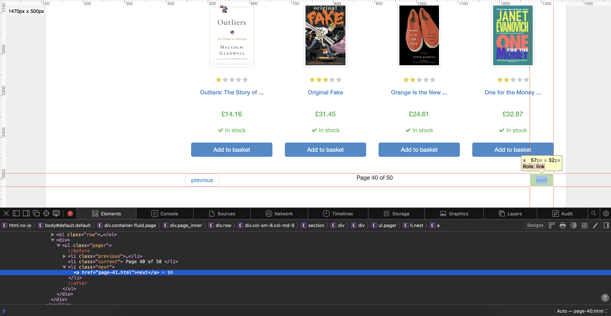

Para manejar correctamente las excepciones, ajustamos la lógica de generación de URLs:


```python
    def parse(self, response):
        books = response.css('article.product_pod')
        
        for book in books:
            yield {
                'name' : book.css('h3 a::text').get(),
                'price' : book.css('.product_price .price_color::text').get(),
                'url' : book.css('h3 a').attrib['href']
            }

        next_page = response.css('li.next a ::attr(href)').get()

        if next_page is not None:
            if 'catalogue' in next_page:
                next_page_url = 'https://books.toscrape.com/' + next_page
            else: 
                next_page_url = 'https://books.toscrape.com/catalogue/' + next_page
            yield response.follow(next_page_url, callback=self.parse)
```

Verificamos los resultados obtenidos con nuestro spider. Ejecuta el spider nuevamente:

```terminal
scrapy crawl bookspider
```

### Proyecto scraper - parte II

A continuación crearemos un nuevo proyecto, para obtener la información de cada uno de los libros [books.toscrape.com](https://wwww.books.toscrape.com). Partiremos del método `parse` del proyecto anterior. 

```python
def parse(self, response):
        books = response.css('article.product_pod')
        
        for book in books:
            relative_url = book.css('h3 a ::sttr(href)').get()

            if 'catalogue' in relative_url:
                book_url = 'https://books.toscrape.com/' + relative_url
            else: 
                book_url = 'https://books.toscrape.com/catalogue/' + relative_url
            yield response.follow(book_url, callback=self.parse_book_page)
```
En la variable `books` obtenemos la información de cada uno de los libros de la página actual. A continuación iteramos en cada uno de elementos con la finalidad de extraer el atributo `href`. 

Mediante el método `follow` rastermos la url del libro y utilizamos el método `parse_book_pag`, el cual definieros a continuación, pero primero exploraremos la estructura HTML mediante en la linea de comandos `scrapy shell`.

```terminal
scrapy shell
fetch('http://books.toscrape.com/catalogue/a-light-in-the-attic_1000/index.html')

```
A continuación exploramos la página de libro:

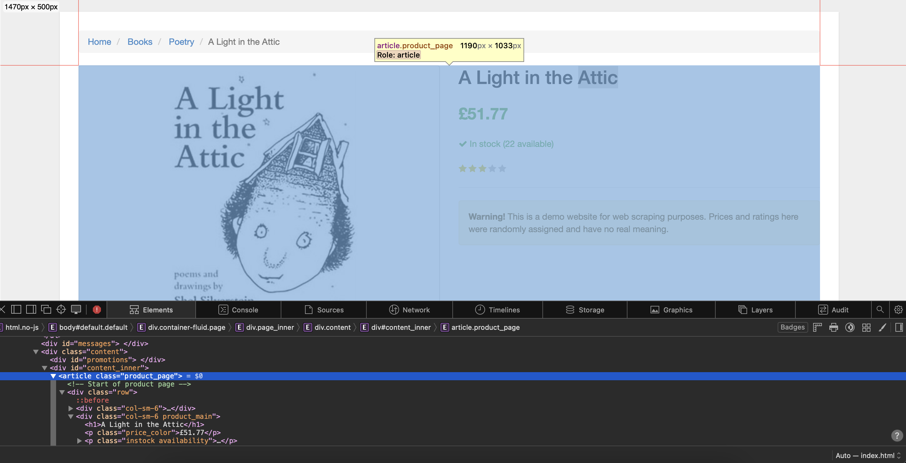

```terminal
#obtener la página
response.css('.product_page')
```
Exploramos la etiqueta HTML relacionada con el título del libro.

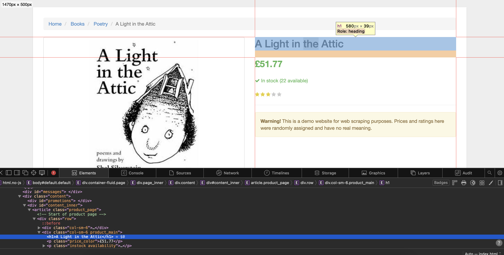

```terminal
#obtener titulo del libro
response.css('.product_main h1::text').get()
```

Exploramos la etiqueta HTML relacionada con el género del libro.
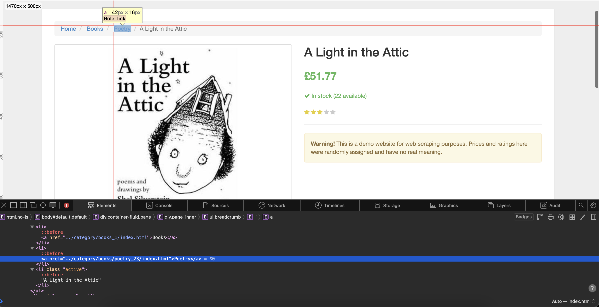

En este caso, no contamos con un atributo `class` o id que nos permita identificar la etiqueta `li`. Sin embargo, la siguiente etiqueta `li` tiene un como atributo `class` igual a `active`. Utilizaremos esta característica para extraer lo datos de interes.

```terminal
# obtener el género de libro
response.xpath('//ul[@class="breadcrumb"]/li[@class="active"]`preceding-sibling::li[1]/a/text()').get()
```
Los _axes_ `preceding-sibling` y `following-sibling` permiten recorrer los hermanos anteriores o siguientes del elemento actual. Por lo tanto `preceding-sibling::li[1]` permite obtener la etiqueta `li` anterior a `li[@class="active"]`.

Ahora exploraremos la eetiqueta relacionada a la descripción del libro.

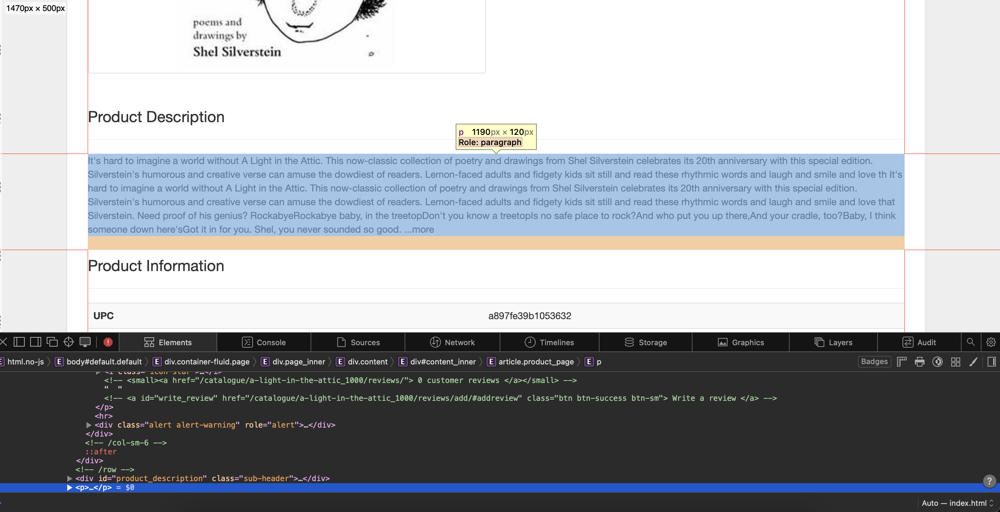

Nunevamente la etiqueta `p` de interes no tienes asociado algún atributo que nos permite extraerla, sin embargo, la etiqueta `div` previa tiene un `id` igual a `product_description`.  Utilizaremos `following-sibling` para extraer la etiqueta de interes. 

```terminal
# obtener la descripción
response.xpath('//div[@id="product_description"]/following-sibling::p/text()').get()
```

Exploremos ahora las etiquetas relacionadas con la información restante del libro.
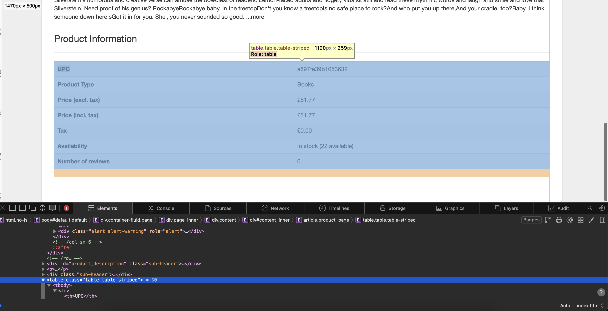

```terminal
# obtener la tabla de datos
table_rows = response.css('table tr')

# obtener el tamaño de table_rows
len(table_rows)

# obtener el tipo de producto, etc
table_rows[1].css('td ::text').get()
table_rows[2].css('td ::text').get()

# obtener rating
response.css('p.star-rating').attrib['class']
```

Después de explorar el código HTML de un caso particular de uno de los libros, podemos construir el método `parse_book_page`.

```python
def parse_book_page(self, response):
    table_rows = response.css('table tr')
    yield {
        'url' : response.url,
        'title' : response.css('.product_main h1::text'.get),
        'upc' : table_rows[1].css('td ::text').get(),
        'product_type' : table_rows[2].css('td ::text').get(),
        'price_excl_tax' : table_rows[3].css('td ::text').get(),
        'price_incl_tax' : table_rows[4].css('td ::text').get(),
        'tax' : table_rows[5].css('td ::text').get(),
        'availability' : table_rows[6].css('td ::text').get(),
        'num_reviews' : table_rows[7].css('td ::text').get(),
        'stars' : response.css('p.star-rating').attrib['class'],
        'category' : response.xpath('//ul[@class="breadcrumb"]/li[@class="active"]/preceding-sibling::li[1]/a/text()').get(),
        'description' : response.xpath('//div[@id="product_description"]/following-sibling::p/text()').get(),
        'price' : response.css('p.price_color ::text').get(),
    }
```

Al final el código final del spider se muestra a continuación, donde se incluye una sección de código que permite iterar en todas las páginas del catalogo de libros. 

```python
import scrapy


class BookspiderSpider(scrapy.Spider):
    name = "bookspider"
    allowed_domains = ["books.toscrape.com"]
    start_urls = ["https://books.toscrape.com"]

    def parse(self, response):
        books = response.css('article.product_pod')
        
        for book in books:
            relative_url = book.css('h3 a ::attr(href)').get()

            if 'catalogue' in relative_url:
                book_url = 'https://books.toscrape.com/' + relative_url
            else: 
                book_url = 'https://books.toscrape.com/catalogue/' + relative_url
            yield response.follow(book_url, callback=self.parse_book_page)

        next_page = response.css('li.next a ::attr(href)').get()
        if next_page is not None:
            if 'catalogue' in next_page:
                next_page_url = 'https://books.toscrape.com/' + next_page
            else: 
                next_page_url = 'https://books.toscrape.com/catalogue/' + next_page
            yield response.follow(next_page_url, callback=self.parse)

    def parse_book_page(self, response):
        table_rows = response.css('table tr')
        yield {
            'url' : response.url,
            'title' : response.css('.product_main h1::text'.get),
            'upc' : table_rows[1].css('td ::text').get(),
            'product_type' : table_rows[2].css('td ::text').get(),
            'price_excl_tax' : table_rows[3].css('td ::text').get(),
            'price_incl_tax' : table_rows[4].css('td ::text').get(),
            'tax' : table_rows[5].css('td ::text').get(),
            'availability' : table_rows[6].css('td ::text').get(),
            'num_reviews' : table_rows[7].css('td ::text').get(),
            'stars' : response.css('p.star-rating').attrib['class'],
            'category' : response.xpath('//ul[@class="breadcrumb"]/li[@class="active"]/preceding-sibling::li[1]/a/text()').get(),
            'description' : response.xpath('//div[@id="product_description"]/following-sibling::p/text()').get(),
            'price' : response.css('p.price_color ::text').get(),
    }
```
Por último, ejecutamos  el spider para verificar que todo esta correcto.

```terminal
scrapy crawl bookspider -O bookdata.csv
```

o 

```terminal
scrapy crawl bookspider -O bookdata.json
```
El párametro `-O` nos permite almacenar el resultado del scraping en un archivo de tipo `csv` o `json`.


## Items

Los Items en Scrapy son contenedores de datos estructurados que permiten definir los campos que se quieren extraer del sitio web. La estructura básica del scraper incluye el script `items.py`. A continuación se muestra la estructura inicial propuesta para un item.

```python
import scrapy


class BookscraperItem(scrapy.Item):
    # define the fields for your item here like:
    # name = scrapy.Field()
    pass
```

A continuación crearemos una clase al final del script `items.py`, la característica de esta clase es que hereda todos los atributos y comportamientos de `scrapy.Item`.

```python
class BookItem(scrapy.Item):
    url = scrapy.Field()
    title = scrapy.Field()
    upc = scrapy.Field()
    product_type = scrapy.Field()
    price_excl_tax = scrapy.Field()
    price_incl_tax = scrapy.Field()
    tax = scrapy.Field()
    availability = scrapy.Field()
    num_reviews = scrapy.Field()
    stars = scrapy.Field()
    category = scrapy.Field()
    description = scrapy.Field()
    price = scrapy.Field()
```

Para que este clase sea reconocida en nuestro scraper, es necesario realizar la importación del modulo en nuestro spider `bookspider.py`. 

```python
from bookscraper.items import BookItem
```
Una vez realizada la importación de nuestra clase `BookItem` podemos realizar ajustes al método `parse_book_page`.

```python
def parse_book_page(self, response):
        table_rows = response.css('table tr')
        book_item = BookItem()

        book_item['url'] = response.url,
        book_item['title'] = response.css('.product_main h1::text').get(),
        book_item['upc'] = table_rows[0].css('td ::text').get(),
        book_item['product_type'] = table_rows[1].css('td ::text').get(),
        book_item['price_excl_tax'] = table_rows[2].css('td ::text').get(),
        book_item['price_incl_tax'] = table_rows[3].css('td ::text').get(),
        book_item['tax'] = table_rows[4].css('td ::text').get(),
        book_item['availability'] = table_rows[5].css('td ::text').get(),
        book_item['num_reviews'] = table_rows[6].css('td ::text').get(),
        book_item['stars'] = response.css('p.star-rating').attrib['class'],
        book_item['category'] = response.xpath('//ul[@class="breadcrumb"]/li[@class="active"]/preceding-sibling::li[1]/a/text()').get(),
        book_item['description'] = response.xpath('//div[@id="product_description"]/following-sibling::p/text()').get(),
        book_item['price'] = response.css('p.price_color ::text').get(),

        yield book_item
```

## Pipelines

Los pipelines de Scrapy se utilizan para procesar los datos extraídos antes de almacenarlos, ya sea para limpiar, validar o guardar en una base de datos. Al igual que `items.py`. Nuestro proyecto tiene el script `pipelines.py`. En su estructura inicial nuestro scraper tiene la siguiente estructura:

```python
from itemadapter import ItemAdapter


class BookscraperPipeline:
    def process_item(self, item, spider):
        return item
```

A continuación agregaremos cada uno de los pipelines necesarios para limpirar nuestros datos.

```python
class BookscraperPipeline:
    def process_item(self, item, spider):

        adapter = ItemAdapter(item)

        # strip all whitespaces from strings
        field_names = adapter.field_names()
        for field_name in field_names:
            if field_name != 'description':
                value = adapter.get(field_name)
                adapter[field_name] = value[0].strip()

        # category & product type --> switch to lowercase
        lowercase_keys = ['category', 'product_type']
        for lowercase_key in lowercase_keys:
            value = adapter.get(lowercase_key)
            adapter[lowercase_key] = value.lower()

        #price --> convert to float
        price_keys = ['price', 'price_excl_tax', 'price_incl_tax', 'tax']
        for price_key in price_keys:
            value = adapter.get(price_key)
            value = value.replace('£', '')
            adapter[price_key] = float(value)

        # availability --> extract number of books in stock
        availability_string = adapter.get('availability')
        split_string_array = availability_string.split('(')
        if len(split_string_array) < 2:
            adapter['availability'] = 0
        else:
            availability_array = split_string_array[1].split(' ')
            adapter['availability'] = int(availability_array[0])

        ## reviews --> convert string to number
        num_reviews_string = adapter.get('num_reviews')
        adapter['num_reviews'] = int(num_reviews_string)

        # Stars --> convert text2number
        stars_string = adapter.get('stars')
        split_stars_array = stars_string.split(' ')
        stars_text_value = split_stars_array[1].lower()
        if stars_text_value == "zero":
            adapter['stars'] = 0
        if stars_text_value == "one":
            adapter['stars'] = 1
        if stars_text_value == "two":
            adapter['stars'] = 2
        if stars_text_value == "three":
            adapter['stars'] = 3
        if stars_text_value == "four":
            adapter['stars'] = 4
        if stars_text_value == "five":
            adapter['stars'] = 5

        return item

```

Es necesario revisar si en `settings.py` estan habilitados los pipelines, para eso en necesario quitar los comentarios de las siguientes líneas:

```python
ITEM_PIPELINES = {
   "bookscraper.pipelines.BookscraperPipeline": 300,
}
```

Para listar los scrapers

```terminal
scrapy list
```

Ejecutamos el scraper

```terminal
scrapy crawl bookspider -O cleandata.json  
```

Si se desea concatener el resultado a un archivo ya existen, sustituir `-O` por `-o`. 

## Databases 

 En `setting.py` se puede utilizar `FEEDS` para especificar la forma de guardar la salida del proceso del *scraping*.

 ```python
 FEEDS = {
    'booksdata.json' : {'format': 'json'}
}
 ```
 
 Al agregar el segmento de código anterior, ya no sera necesario utilizar ´-O bookdata.json` para guardar los datos.

 Otra forma de especificar la configuración para guardar los datos es en el código de la clase de nuestro Spider (`BookspiderSpider`), como un atributo más de la clase.

 ```python
 custom_settings = {
    'FEEDS' {
    'booksdata.json' : {'format' : 'json'}, 'overwrite' : True,
    }
}
 ```

 Esto sobreescribira la especificación de `FEEDS` del archivo `settings.py` de existir.