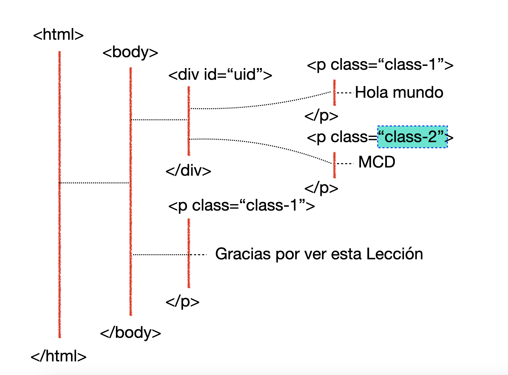

# Comprensión de los datos - Obtención de los datos

## Web Scraping

El web scraping es una técnica utilizada para extraer datos de sitios web de forma automatizada. A través de programas o scripts, se accede al contenido de una página web, se analiza su estructura HTML y se extrae información específica, como texto, imágenes, precios de productos, titulares de noticias, entre otros.

### HTML

HTML (HyperText Markup Language) es el lenguaje estándar utilizado para estructurar y presentar contenido en la web. Es un lenguaje de marcado que define la estructura básica de las páginas web mediante etiquetas. Estas etiquetas indican al navegador cómo debe interpretar y mostrar el contenido, como texto, imágenes, enlaces, y otros elementos.

Para realizar`*scraping* en un sitio web necesutaremos navegar en el código HTML para encontrar lo que nos interesa.

Ejemplo de un código simple de HTML

````html
<html>
	<body>
		<div>
			<p>Hello world!</p>
			<p>Hello world!</p>
		</div>
			<p>Thanks for all!</p>
	</body>
</html>
````

Estructura de un documento HTML:

	1.	<!DOCTYPE html>: Declara el tipo de documento como HTML5.
	2.	<html>: Representa la raíz del documento.
	3.	<head>: Contiene metadatos sobre el documento (como el título y enlaces a hojas de estilo).
	4.	<body>: Incluye todo el contenido visible de la página.

Algunas etiquetas comunes:

1.	Encabezados: `<h1>` a `<h6>` para títulos y subtítulos. Ejemplo: `<h1>Encabezado principal</h1>`.
2.	Párrafos: `<p>` para texto de párrafo. Ejemplo:`<p>Este es un texto.</p>`.
3.	Enlaces: `<a href="URL">Texto del enlace</a>`.
4.	Imágenes: ``.
5.	Listas:
    - No ordenadas: `<ul>` con `<li>`.
    - Ordenadas: `<ol>` con `<li>`.

#### Árbol HTML

Las etiquetas están anidadas unas dentro de otras, como las etiquetas `body`dentro de `html`. Esto da lugar a la jerarquía, que se representa como un árbol. 


#### Atributos 

Ejemplo de un formato de los atributos de una etiqueta abstracto
```html
<tag-name attrib-name="attrib info">
	..element contents
</tag-name>
````
Las etiquetas __html__, __div__, y __p__ pueden contener atributos que proporcionan instrucciones especiales para el contenido incluido. 
Los atributos están seguidos por un signo igual, seguido de información que es valor del atributo.

Ejemplo específico de un __div__:
````html
<div id="unique-id" class="some class">
	..div elemen contents
</div>
````

El atributo `id` se utiliza como identificador único para el elemento de etiqueta.
El atributo `class` también nos ayuda a identificar este `div` pero no es único. 
No todas las etiquetas tienen un `id` o `class` pero a todas las etiquetas se les puede asignar ambos. 
- Una etiqueta puede pertenecer a múltiples clases, cuando el atributo de clase tiene múltiples nombres de clases separados por espacios, en el ejemplo anterior la etiqueta `div` pertenece a las clases: `some` y `class`.
Otro ejemplo:
````html
<a href="https://www.utm.mx">
	Este es el link a la página de la universidad
</a>
````
- La etiqueta `a` e` un hipervínculo, y tiene el atributo `href` que indica la pagina a la que se dirige la liga.
- Existen muchos tipos de etiquetas permitidos 
- Y muchos atributos que dependen del tipo de etiqueta.
  
### XPath

XPath (XML Path Language) es un lenguaje utilizado para navegar y seleccionar nodos en un documento XML. Permite localizar elementos, atributos, o texto dentro de un documento XML de manera eficiente, utilizando rutas y patrones específicos.

Nosotros utilizaremos XPath para convertir la navegación verbal de una estructura HTML en una variable para que la computadora la pueda procesar.

#### Notación de XPath

- La barra diagonal `/` se utiliza para avanzar una generación adelante del nodo actual, como si se navegara en directorios o escribiendo una url en el navegador.
- Los nombres de etiquetas entre las diagonales, indican la dirección de los elementos o nodos.
- Los `[]` delante un nombre de etiqueta indica cual de los hermanos elegir. Por ejemplo, puede haber varios elementos `div`que sean hijos de un elemento `body`.


````python
xpath = '/html/body/div[2]'
````
En el ejemplo anterior represena la ruta para llegar el tercer `div` descendiente de `body`, como se muestra en la siguiente figura.


- La barra diagonal doble `//` se utiliaza para avanzar en todas descendientes del nodo actual, es decir todas sus generaciones siguientes. 

Por ejemplo, navegar a todos los elementos de tipo `table` dentro del código HTML.

````python
xpath = '//table'
````
[`Ejercicio 1`](./exercise/exercise-1-where.ipynb)

#### Atributos en XPath

El uso del símbolo `@` en la notación XPath representa un atributo, por ejemplo: `@class`, `@id`, `@href`. 

Si consideramos la extructura del siguiente código HTML:


La forma de indicar un atributo es mendiante corchetes `[]`, por ejemplo, el siguente `xpath` se dirige a todos los elementos `p` y lueg reduce a aquellos cuyo atributo sea igual a `class-1`:

```python
xpath = '//p[@class="class-1"]'
```


En otro ejemplo:

```python
xpath = '//*[@id="uid"]'
```

El XPath se dirige a todos los elementos y se reduce a cualquier elemento que tenta `uid` como atributo `id`.


Si consideramos el siguente ejemlo:

```python
xpath = '//div[@id="uid"]/p[2]'
```
El XPath se dirige a todos los elementos `div` reduce a aquellos que tengan `uid` como atributo `id` y reduce al segundo párrafo hijo.


#### Uso de `contains`

La función `contains` se puede utilizar dentro de la notación XPath con la finalidad de encontrar subcadenas en el atributos específicado.

Forma general de `contains`:

```python
contains(@attri-name, "string-expr")
```

El formato de `contains` incluye como primer parámetro el nombre del atributo, el el parámetro derecho indica la subcadena que queremos buscar dentro del atributo.
 
Por ejemplo:

```python
xpath = '//*[contains(@class, "class-1")]'
```


En la expresión anterior se eligen a todos los elementos donde en el atributo `class` se encuentra contenida la cadena `class-1` como subcadena. Nótese como en el caso de `"class-12"` se encuentra contenida la subcadena `"class-1".` 

En contraste con el uso de `@`, compara los resultados del siguiente ejemplo:


A diferencia de `contains` solo se seleccionan aquellas etiquetas donde el atributo `@class` coincide exactamente con el valor `"class-1"`.

#### Obtención del valor de atributo

En algunas cirunstancias el uso de los atributos no solo guiran la extracción de la información, si no que, necesitaremos obtener el valor contenido en algún atributo. En el siguiente ejemplo, se muestra la diferencia entre ontener la información obtenida entre las etiquetas en contraste con obtener el valor contenido en el atributo.

```python
xpath = '/html/body/div/p[2]'
```


Mientras que en el siguiente ejemplo, se obtiene el contenido del atributo `@class`

```python
xpath = '/html/body/div/p[2]/@class'
```


#### Encadenamiento de XPath

Los objetos `Selector`y `SelectorList` permiten el encadenamiento al utilizar el método `xpath`. Lo que significa que se puede aplicar el métod `xpath`una vez que ya se ha aplicado. Por ejemplo:

```python
sel.xpath('/html/body/div[2]')
```

Es igual a:
```python
sel.xpath('/html').xpath('./body/div[2]')
```

ó a:

```python
sel.xpath('/html').xpath('./body').xpath('./div[2]')
```

La unica diferencia que se tienen que pegar las piezas de XPath al utilizar el punto `.` al principio de cada subcadena de XPath.


[Ejercicio 2.](./exercise/exercise-2-xpath.ipynb)

#### La fuente de la fuente: de donde vienen los documentos HTML

Es necesario considerar dos herremientas que serán de utilidad cuando realices *scraping* a un sitio web. 

- visualizar el código fuente en tu navegador
- El inspector de código HTML

Ambas herremientas están disponibles en tu navegador, sin importar cual utilices. Solo es cuestión de que identifiques en que sección puedes disponer de ellos.

Por ejemplo, la opción "ver código" en Chrome se puede acceder al realizar clic derecho sobre la página en cuestión.


La opción inspect o inspeccionar te mostrará una sección con la posibilidad de acceder a las herramientas para desarrolladores. Son útiles para probar el diseño de las páginas web, depurar, omitir información sensible de las capturas de pantalla, investigar palabras clave ocultas y mucho más.


Te invito a investigar más acerca de estas dos herramientas, ya que te serán muy utiles en tus proyectos de extracción de datos mediante `scraping`.

### CSS Locators

Los CSS Locator son una forma alternativa a los XPath.

CSS Locators son selectores utilizados en CSS para identificar y aplicar estilos a elementos específicos en una página web. También son ampliamente utilizados en pruebas automatizadas (como en Selenium) para interactuar con elementos del DOM.

#### Notación CSS Locator

Una vez que hemos aprendido la notación de XPath nos resultará muy fácil comprender la notación de CSS Locators.

Vamor a reemplazar `/`  por `>`(excepto el primer carácter `/` es ignorado)
- XPath: `/html/body/div`
- CSS Locator: `html>body>div`
  
Vamos a reemplazar `//` por un espacio en blanco (excepto si es el primer carácter, es ignorado)
- XPath: `//div/span//p`
- CSS Locator: `div > span p`

Por último, vamor a reemplazar `[N]` por `:nth-of-type(N)`
- XPath: `//div/p[2]`
- CSS Locator: `div > p:nth-of-type(2)`

#### Atributos `class` y `id`

La razón principal para aprender CSS Locator como una alternativa a XPath es su notación simple para la identificación de atributos de clases y de identificación.

- Para encontrar elementos por **clase** se utilizar `.`
	- Ejemplo: `p.class-1` selecciona todos los elementos de párrafo pertenecientes a `class-1`.
- Para encontrar un elemento por **id** se utiliza `#`
	- Ejemplo: `div#uid` selecciona los elementos `div`con `id` igual a `uid`.

Para seleccionar los elementos de párrafo con la clase `class1` se utiliza:
````python
css_locator = 'div#uid > p.class1'
````
Para seleccionar todos los elementos los cuales su atributo clase pertenece a `class1`:
````python
css_locator = '.class1'
````

Algunos aspectos a considerar al utilizar CSS Locator como alternativa de XPath, son los siguientes:

```python
css = '.class-1'
```


```python
css = '//*[@class="class-1"]'
```


- En el ejemplo del CSS Locator nos dirige a los elememtos que pertenecen a la clase `class-1` incluso si pertenece a otras clases
- En el ejemplo de XPath, la igualdad del obliga a una coincidencia exact del atributo de la clase, por lo que solo, aquellas etiquetas que councidan unicamente con `class-1` son seleccionadas.

Como complemento a esta diferencia, consideremos si utilizamos `contains` el XPath busca todas las coincidencias con la subcadena.

```python
css = '//*[contains(@class, "class-1")]'
```


#### Atributos CSS y selección de texto

Al igual que en XPath, podemos acceder a los atributos y al texto.

- En notación XPath: `<xpath-to-element>/@attr-name`
```python
xpath = '//div[@id="uid"]/a/@href'
```
- En CSS Locator: `<css-to-element>::attr(attr-name)`
```python
css_locator = 'div#uid > a::attr(href)'
```
Para realizar la extracción de texto

```html
<p id="p-example">
	Hello world!
	Visit <a href="http://www.utm.mx">UTM</a> today!
</p>
```
- En XPath se utiliza el método `text()`
Si se utiliza diagonal simple, se obtiene el texto de la etiqueta actual
```python
sel.xpath('//p[@id="p-example"]/text()').extrac()
# El resultado ['\n Hello world!\n Visit', 'today!\n']
```
Si se utiliza doble diagonal, se obtiene el texto y el texto de los descendientes
```python
sel.xpath('//p[@id="p-example"]//text()').extrac()
# El resultado ['\n Hello world!\n Visit', 'UTM', 'today!\n']
```
- Para CSS Locator, se utiliza `::text`
```python
sel.css('p#p-example::text').extract()
# El resultado ['\n Hello world!\n Visit', 'today!\n']

sel.css('p#p-example ::text').extract()
# El resultado ['\n Hello world!\n Visit', 'UTM', 'today!\n']
```

[Ejercicio 3](./exercise/exercise-3-css-locator.ipynb)


