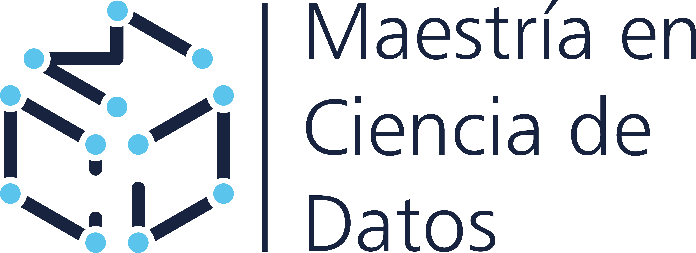

# Proyecto Aplicado I

Por: Christian Millán

**Universidad Virtual de la Universidad Tecnológica de la Mixteca**

*Maestría en Ciencia de Datos*

## Objetivo 

> Obtener y preparar la base de datos con la que se trabajará el proyecto a lo largo de todo el programa de estudios. - plan de estudios.

> El alumno será capaz de aplicar los principios de la ciencia de datos para la formulación de proyectos de ciencia de datos bajo una metodología y la disponibilidad de datos.  -Millán.

# Contenido

## Unidad 1. Comprensión del negocio
Incluye temas de: *Unidad 1. Definición del problema y obtención de los datos*

1. [Ambientes virtuales](./00-ambiente/README.md)
2. [Obtención de datos mediante APIs](./01-data_understanding/get_data_api.ipynb)
3. [Obtención de datos mediante Web Scraping](./02-data_understanding_get_scraping/README.md)
4. [Obtención de datos de un DBMS]

## Unidad 2. Comprensión de los datos del negocio
Incluye temas de: *Unidad 2. Limpieza de datos, Unidad 3. Creación de la base de datos y Unidad 4. Estadística descriptiva de la base de datos*

1. [Análisis Exploratorio de los datos](./03-data_understanding_description/README.md)

  <!--
1. [Estadísticos básicos]() 
 
2. [Introducción a la visualización de datos]()
3. [Exploración de variables categóricas y análisis multivariable]()
4. [Correlaciones y Regreión Lineal Simple]()
5. [Distribuciones muestrales y técnicas de evaluación de modelos]()
6. [Visualización de datos avanzada]()
7. [Pruebas A/B]()
8. -->